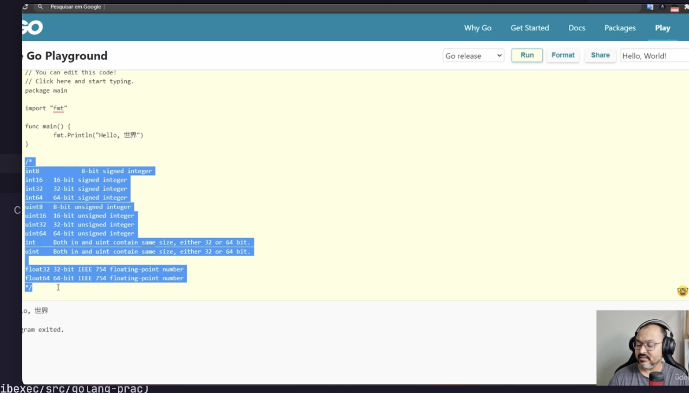

# Share my road learning Golang!

#### Caracteristícas

Criado em 2009
Problemas de concorrência

- Open Source, Tipagem, Concorrencia nativo, Biblioteca nativa poggers
- WebApplications, Frontend, CLI, Network..
- Fácil e desenvolvimento rápido, curva de aprendizado baixa. Possuí menos sintaxe e é bem simples.

- Google, Twitch, Twitter, Mercado Livre..

- Sem máquina virtual...

||
Serviço decentralizado, baixa direto do github
Adota melhoras features de linguagem funcional
Interface implicitas
Manipulação de erro direta
Teste ja é nativo.

- Go playground (Online IDE)

file.go -> Estrutura

- package main : Módulo onde estamos criando (main)
- fmt -> Printar no console.

Go tem mt pacote nativa.

Função inicia-se com **func**

Variáveis no go
**var** : Palavra reservada
**var [nomeDaVariavel] [tipo]**

Não deu valor para int? -> é 0

Atribuição :: Pode atribuir depois de declarar a VAR

Criação e atribuição ao mesmo tempo::
**variable := result**

O tipo ja é auto tipado.

Não pode usar palavras reservadas pelo golang (func,var,import,go....)

#### Tipos de dados

Tipos são estásticos -> Depois de declarados não da para mudar.
É possível alterar o valor quando ele é do mesmo tipo.
Não da para atribuir antes de criar.

Tipos compostos -> Nós mesmos criamos/precisamos.

**_string | int | float32 | bool | _**

Quando cria uma variável e não é atribuido um valor, ela automáticamente fica com um valor.

```
string : 0
int : 0
bool : false
float32 : 0
```

#### Operadores

Matematicos(/ , - , + , \*)

Lib reflect -> Tipo da variável
reflect.typeOf(variable)
String só somar tb

const -> Variáveis constantes, não altera

Tipos de inteiros, e seu tamanho máximo.



signed / unsigned

uint -> Não pode valores negativos -> unsigned
signed -> Pode negativos

#### Conversões

int8 para int.

```go
var numero int8 = 127
var numeroInt
numeroInt = int(numero)

```

int para float

```go
var numero int = 127
var numeroInt float32
numeroInt = float32(numero)

```

float para int -> Arredonda para baixo.

```go
var numero float32 = 127.5
var numeroInt int
numeroInt = int(numero)

```

String para outros tipos de dados
strconv -> Package do Go

```go
parseBool
parseFloat
parseInt
parseUint

func main(){
    converted,err := strconv.parseBool("true")
    if(err == null){
        return err
    }
    fmt.Println(converted)
}
```

Função retorna 2 valores, o dado em sí e o segundo é o erro.

Printf -> usar % para tipo do dado e formatações.

```go
func main(){
    text := "42.55"
    converted,err := strconv.ParseFloat(text,64)
    fmt.Printf("%T \n",converted)
    fmt.Println(converted)
}
```

##
